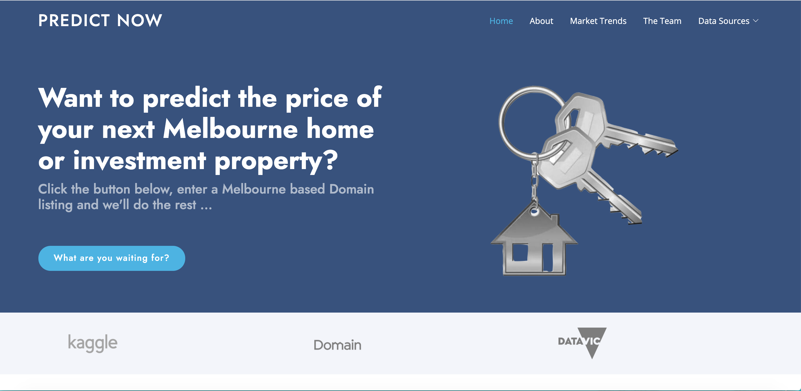
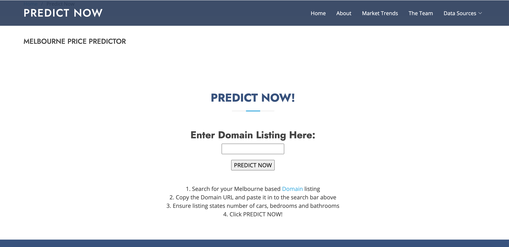
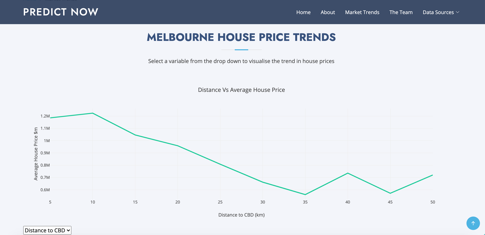

# Melbourne Price Predictor 

This project utilises Machine Learning to predict Melbourne property prices. It provides a simple resource for prospective property buyers to value listings they have found on Domain.com.au.  The web app scrapes property information from a provided Domain URL, appending crime and location information to the scraped data. The model then predicts a value for the property based on the listing information it receives. The webpage also provides housing trend visualisations to assist potential property buyers in their research.

## Heroku deployment

The project has been deployed to Heroku and is available [here](https://melbpricepredictor.herokuapp.com/)

## The Team 

- Catherine Sloan: https://github.com/catherinesloan
- Danielle Cahill: https://github.com/dan1ellec
- Anne Wieggers: https://github.com/annewieggers
- Tom Peddlesden: https://github.com/tomjp90 
- Joe Quinn: https://github.com/joeq94

## Data sources 

- [Melbourne Housing Data](https://www.kaggle.com/anthonypino/melbourne-housing-market?select=Melbourne_housing_FULL.csv)

- [Victorian Crime Data](https://discover.data.vic.gov.au/dataset/crime-by-location-data-table)

## Libraries and Technologies 

Machine Learning
-  XGBoost
- Scikit-learn
- Pandas
- Joblib

Back End
- Flask
- Flask PyMongo
- Numpy	
- scrape_mars
- requests
- BeautifulSoup 
- Selenium
- OS
- Splinter
- ChromeDriverManager
- Time
- Sys

Front end
- HTML
- CSS
- Javascript
- Bootstrap

## The Model

The XGBRegressor model from the XGBoost library was utilised for this project. Two versions of the model were created to accomodate the variation in property information included on Domain.

Model 1 was trained on the following features:
1. Number of Bedrooms
2. Number of Bathrooms
3. Number of Car Spaces
4. Property Type (Unit, Townhouse, House)
5. Year of sale
6. Month of sale
7. Suburb Crime Rate
8. Distance from CBD
9. Land Size

Model 2 was trained on the following features:
1. Number of Bedrooms
2. Number of Bathrooms
3. Number of Car Spaces
4. Property Type (Unit, Townhouse, House)
5. Year of sale
6. Month of sale
7. Suburb Crime Rate
8. Distance from CBD

## Preview

